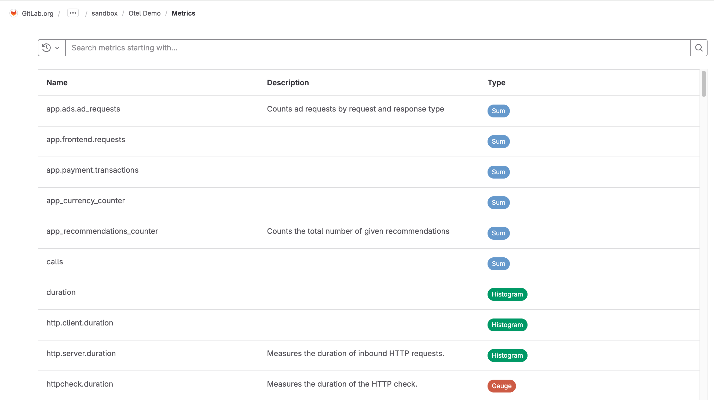

# Metrics

DETAILS:
**Tier:** Ultimate
**Offering:** GitLab.com
**Status:** Experiment

> - [Introduced](https://gitlab.com/gitlab-org/gitlab/-/merge_requests/124966) in GitLab 16.7 [with a flag](../administration/feature_flags.md) named `observability_metrics`. Disabled by default. This feature is an [Experiment](../policy/experiment-beta-support.md#experiment).

FLAG:
This feature is only available on GitLab.com. On self-managed GitLab and GitLab Dedicated, by default this feature is not available.
The feature is not ready for production use.

Metrics provide insight about the operational health of monitored systems.
Use metrics to learn more about your systems and applications in a given time range.

Metrics are structured as time series data, and are:

- Indexed by timestamp
- Continuously expanding as additional data is gathered
- Usually aggregated, downsampled, and queried by range
- Have write-intensive requirements

## Configure metrics

Configure metrics to enable them for a project.

Prerequisites:

You must have at least the Maintainer role for the project.

1. Create an access token and enable metrics:
   1. On the left sidebar, select **Search or go to** and find your project.
   1. Select **Settings > Access Tokens**.
   1. Create an access token with the following scopes: `read_api`, `read_observability`, `write_observability`. Be sure to save the access token value for later.
   1. Select **Monitor > Metrics**, and then select **Enable**.
1. To configure your application to send GitLab metrics, set the following environment variables:

   ```shell
   OTEL_EXPORTER = "otlphttp"
   OTEL_EXPORTER_OTLP_METRICS_ENDPOINT = "https://observe.gitlab.com/v3/<namespace-id>/<gitlab-project-id>/ingest/metrics"
   OTEL_EXPORTER_OTLP_METRICS_HEADERS = "PRIVATE-TOKEN=<gitlab-access-token>"
   ```

   Use the following values:

   - `namespace-id` - The top-level group ID that contains the project
   - `gitlab-project-id` - The project ID
   - `gitlab-access-token` - The access token you created

Metrics are configured for your project.
When you run your application, the OpenTelemetry exporter sends metrics to GitLab.

## View metrics

You can view the metrics for a given project:

1. On the left sidebar, select **Search or go to** and find your project.
1. Select **Monitor > Metrics**.

A list of metrics is displayed.
Select a metric to view its details.



### Metric details

Metrics are displayed as either a sum, a gauge, or a histogram.
The metric details page displays a chart depending on the type of metric.

On the metric details page, you can also view a metric for a specific time range.


